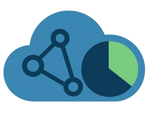

<a id="readme-top"></a>

<!-- PROJECT SHIELDS -->
[![Contributors][contributors-shield]][contributors-url]
[![Forks][forks-shield]][forks-url]
[![Stargazers][stars-shield]][stars-url]
[![Issues][issues-shield]][issues-url]
[![project_license][license-shield]][license-url]
[![LinkedIn][linkedin-shield]][linkedin-url]

<!-- PROJECT LOGO -->
<br />
<div align="center">
  <a href="https://github.com/mariocosenza/kgsum">
    
  </a>

<h3 align="center">KgSum</h3>

  <p align="center">
    A Python application for extracting, preparing, and classifying Knowledge Graphs, leveraging LLMs and traditional machine learning.<br>
    <b>Thesis Project, University of Salerno, ISISLab</b>
    <br />
    <a href="https://github.com/mariocosenza/kgsum/wiki"><strong>Explore the docs »</strong></a>
    <br />
    <a href="https://github.com/mariocosenza/kgsum/issues/new?labels=bug&template=bug-report---.md">Report Bug</a>
    &middot;
    <a href="https://github.com/mariocosenza/kgsum/issues/new?labels=enhancement&template=feature-request---.md">Request Feature</a>
  </p>
</div>

<!-- TABLE OF CONTENTS -->
<details>
  <summary>Table of Contents</summary>
  <ol>
    <li>
      <a href="#about-the-project">About The Project</a>
      <ul>
        <li><a href="#built-with">Built With</a></li>
      </ul>
    </li>
    <li>
      <a href="#getting-started">Getting Started</a>
      <ul>
        <li><a href="#prerequisites">Prerequisites</a></li>
        <li><a href="#installation">Installation</a></li>
        <li><a href="#configuration">Configuration</a></li>
      </ul>
    </li>
    <li><a href="#usage">Usage</a></li>
    <li><a href="#docker-deployment">Docker Deployment</a></li>
    <li><a href="#roadmap">Roadmap</a></li>
    <li><a href="#contributing">Contributing</a></li>
    <li><a href="#license">License</a></li>
    <li><a href="#contact">Contact</a></li>
    <li><a href="#acknowledgments">Acknowledgments</a></li>
  </ol>
</details>

<!-- ABOUT THE PROJECT -->
## About The Project

[![Product Name Screen Shot][product-screenshot]](https://github.com/mariocosenza/kgsum)

**KgSum** is a Python application for extracting, preparing, and classifying Knowledge Graphs (KGs). It combines Large Language Models (such as Mistral Instructor 7B with QLoRA) and traditional machine learning for effective graph classification and profiling.

Thesis Project for Bachelor's Degree  
University of Salerno  
Lab: ISISLab  
Author: Mario Cosenza  
Supervisor: Maria Angela Pellegrino  

<p align="right">(<a href="#readme-top">back to top</a>)</p>

### Built With

* [Python 3.12](https://www.python.org/)
* [PyTorch](https://pytorch.org/)
* [Transformers](https://huggingface.co/docs/transformers)
* [spaCy](https://spacy.io/)
* [Flask](https://flask.palletsprojects.com/)
* [Next.js](https://nextjs.org/)
* [React](https://reactjs.org/)
* [TailwindCSS](https://tailwindcss.com/)

<p align="right">(<a href="#readme-top">back to top</a>)</p>

<!-- GETTING STARTED -->
## Getting Started

Follow these steps to set up KgSum locally.

### Prerequisites

#### For Local Machine Learning Backend:
- **Miniconda** (required)
- **Python 3.12** (suggested)
- **CUDA 12.8** (for transformer models like Mistral)
- **NVIDIA GPU** (recommended: RTX 3070 or higher)

#### For Frontend:
- **Node.js** 
- **npm**

#### For Docker Deployment:
- **Docker**
- **Docker Compose**

### Installation

#### Local Setup (Machine Learning Backend)

1. Clone the repository:
   ```sh
   git clone https://github.com/mariocosenza/kgsum.git
   cd kgsum
   ```

2. Create and activate conda environment:
   ```sh
   conda env create -f environment.yml
   conda activate kgsum
   ```

3. **For GPU/Transformer Models (Mistral):**
   - Comment out CUDA libraries in `environment.yml`
   - Change TensorFlow version to GPU-compatible version as suggested in comments

#### Frontend Setup

1. Install dependencies:
   ```sh
   npm install
   ```

2. Run the frontend:
   ```sh
   npm run dev
   ```

3. **For GraphDB embedding visualization:**
   - Replace GraphDB's `security-config.xml` with the one in `/docker/graphdb`

### Configuration

#### Environment Variables

Set the following environment variables in your shell:

```sh
export GEMINI_API_KEY=your_gemini_api_key_here
export LOCAL_ENDPOINT_LOV=http://your-local-endpoint
export LOCAL_ENDPOINT=http://your-local-endpoint
export SECRET_KEY=your_secret_key_here
export UPLOAD_FOLDER=/path/to/uploads
export NEXT_PUBLIC_CLERK_PUBLISHABLE_KEY=your_clerk_publishable_key
export CLERK_MIDDLEWARE_ENABLED=true  # Set false if authentication not required
export CLERK_SECRET_KEY=your_clerk_secret_key
export CLASSIFICATION_API_URL=http://localhost:5000
export GITHUB_TOKEN=your_github_token_here
```

#### Backend Configuration

Configure the backend by editing `config.json`:

```json
{
  "labeling" : {
    "use_gemini": false,
    "search_zenodo": true,
    "search_github": true,
    "search_lod_cloud": true,
    "stop_before_merging": false
  },
  "extraction": {
    "start_offset": 0,
    "step_numbers": 10,
    "step_range": 16,
    "extract_sparql": true,
    "query_lov": false
  },
  "processing" : {
    "use_ner": false,
    "use_filter": true
  },
  "training" : {
     "classifier": "NAIVE_BAYES",
     "feature": ["CURI", "PURI"],
     "oversample": false,
     "max_token": 256,
     "use_tfidf_autoencoder": true
  },
  "profile": {
    "store_profile_after_training": false,
    "base_domain": "https://example.org"
  },
  "general_settings": {
    "info": "Possible classifiers: SVM, NAIVE_BAYES, KNN, J48, MISTRAL, MLP, DEEP, BATCHNORM, Phase: LABELING, EXTRACTION, PROCESSING, TRAINING, STORE",
    "start_phase": "labeling",
    "stop_phase": "training",
    "allow_upload": "false"
  }
}
```

**Available Classifiers:** SVM, NAIVE_BAYES, KNN, J48, MISTRAL, MLP, DEEP, BATCHNORM  
**Available Features:** CURI, PURI  
**Processing Phases:** LABELING, EXTRACTION, PROCESSING, TRAINING, STORE

<p align="right">(<a href="#readme-top">back to top</a>)</p>

<!-- USAGE EXAMPLES -->
## Usage

### Training Process

#### Full Training Pipeline
Run the complete training process from extraction to model training:
```sh
python train.py
```

#### Individual Script Training
For more fine-tuned control, run individual scripts in `/src`:
```sh
# Run scripts in /src directory for specific phases
```

### Running the Application

#### Local Flask Server
After completing training, start the WSGI Flask server on port 5000:
```sh
python app.py
```

#### Prerequisites for Complete Profiling
- **Linked Open Vocabularies (LOV) instance** is required for complete profiling and initial data extraction

### API Usage

Send POST requests to:
- `/api/v1/profile/sparql`
- `/api/v1/profile/file`

Refer to the Swagger documentation for detailed request and response formats.

<p align="right">(<a href="#readme-top">back to top</a>)</p>

<!-- DOCKER DEPLOYMENT -->
## Docker Deployment

### Quick Setup with Pre-trained Model

For a simpler deployment using the pre-trained Naive Bayes model:

1. Navigate to the docker directory:
   ```sh
   cd /docker
   ```

2. Fill the `.env` file with your configuration

3. Run with Docker Compose:
   ```sh
   docker-compose up
   ```

### Individual Docker Services

Three individual Dockerfiles are provided for custom deployments:
- **Backend** service
- **Frontend** service  
- **GraphDB** configuration

### Hardware Requirements

#### Tested Configuration
| Component | Specification                    |
|-----------|----------------------------------|
| CPU       | AMD Ryzen 5800x                 |
| RAM       | 32 GB DDR4 3600MHz             |
| GPU       | NVIDIA RTX 3070                |

#### Recommended Configuration
| Component | Specification                    |
|-----------|----------------------------------|
| RAM       | 64+ GB (larger size suggested)  |
| GPU       | High-performance GPU for better LLM performance |

<p align="right">(<a href="#readme-top">back to top</a>)</p>

<!-- ROADMAP -->
## Roadmap

- [x] Add Swagger API documentation
- [x] Expand coverage for more LLMs
- [x] Improve Docker deployment documentation
- [ ] Add more dataset preparation examples
- [ ] Add performance optimization guides
- [ ] Enhance frontend visualization features

See the [open issues](https://github.com/mariocosenza/kgsum/issues) for a full list of proposed features (and known issues).

<p align="right">(<a href="#readme-top">back to top</a>)</p>

<!-- CONTRIBUTING -->
## Contributing

Contributions are what make the open source community such an amazing place to learn, inspire, and create. Any contributions you make are **greatly appreciated**.

If you have a suggestion that would make this better, please fork the repo and create a pull request. You can also simply open an issue with the tag "enhancement".
Don't forget to give the project a star! Thanks again!

1. Fork the Project
2. Create your Feature Branch (`git checkout -b feature/AmazingFeature`)
3. Commit your Changes (`git commit -m 'Add some AmazingFeature'`)
4. Push to the Branch (`git push origin feature/AmazingFeature`)
5. Open a Pull Request

<p align="right">(<a href="#readme-top">back to top</a>)</p>

### Top contributors:

<a href="https://github.com/mariocosenza/kgsum/graphs/contributors">
  
</a>

<!-- LICENSE -->
## License

Distributed under the MIT License. See `LICENSE.txt` for more information.

<p align="right">(<a href="#readme-top">back to top</a>)</p>

<!-- CONTACT -->
## Contact

Mario Cosenza - [@mario_cosenza_](https://x.com/mario_cosenza_) - cosenzamario@proton.me  
Supervisor: Maria Angela Pellegrino

Project Link: [https://github.com/mariocosenza/kgsum](https://github.com/mariocosenza/kgsum)

<p align="right">(<a href="#readme-top">back to top</a>)</p>

<!-- ACKNOWLEDGMENTS -->
## Acknowledgments

* University of Salerno, ISISLab
* [Mistral LLM](https://mistral.ai/)
* [LOD Cloud](https://lod-cloud.net/)
* [Zenodo](https://zenodo.org/)
* [Linked Open Vocabularies](https://lov.linkeddata.es/)

<p align="right">(<a href="#readme-top">back to top</a>)</p>

<!-- MARKDOWN LINKS & IMAGES -->
[contributors-shield]: https://img.shields.io/github/contributors/mariocosenza/kgsum.svg?style=for-the-badge
[contributors-url]: https://github.com/mariocosenza/kgsum/graphs/contributors
[forks-shield]: https://img.shields.io/github/forks/mariocosenza/kgsum.svg?style=for-the-badge
[forks-url]: https://github.com/mariocosenza/kgsum/network/members
[stars-shield]: https://img.shields.io/github/stars/mariocosenza/kgsum.svg?style=for-the-badge
[stars-url]: https://github.com/mariocosenza/kgsum/stargazers
[issues-shield]: https://img.shields.io/github/issues/mariocosenza/kgsum.svg?style=for-the-badge
[issues-url]: https://github.com/mariocosenza/kgsum/issues
[license-shield]: https://img.shields.io/github/license/mariocosenza/kgsum.svg?style=for-the-badge
[license-url]: https://github.com/mariocosenza/kgsum/blob/master/LICENSE.txt
[linkedin-shield]: https://img.shields.io/badge/-LinkedIn-black.svg?style=for-the-badge&logo=linkedin&colorB=555
[linkedin-url]: https://linkedin.com/in/mariocosenza
[product-screenshot]: images/logo_isis.png